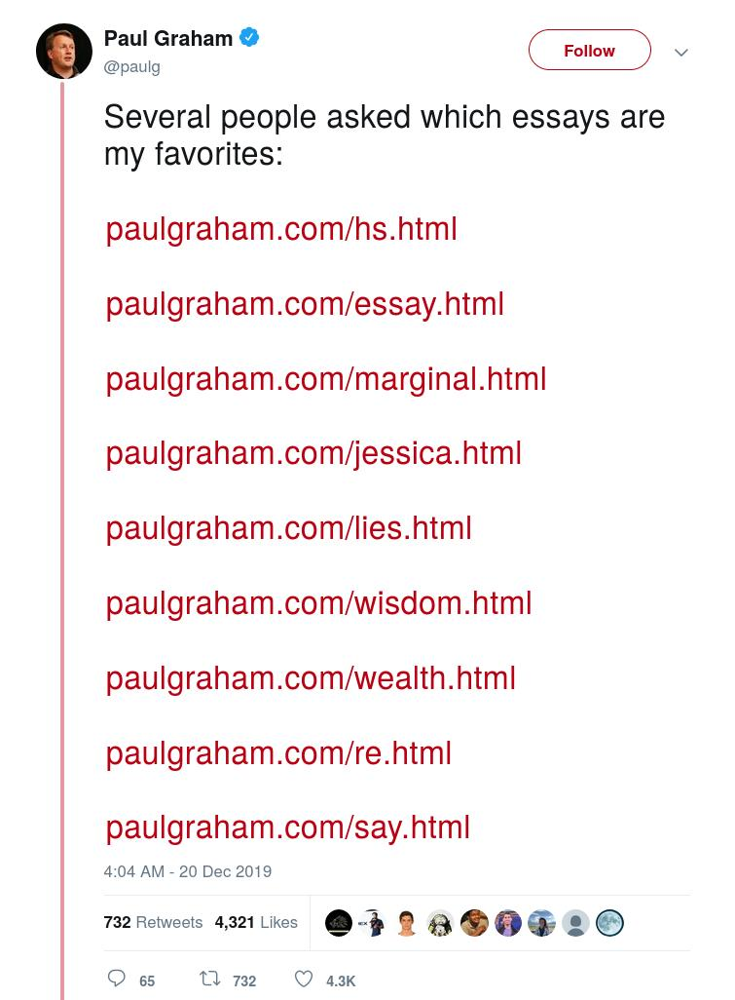
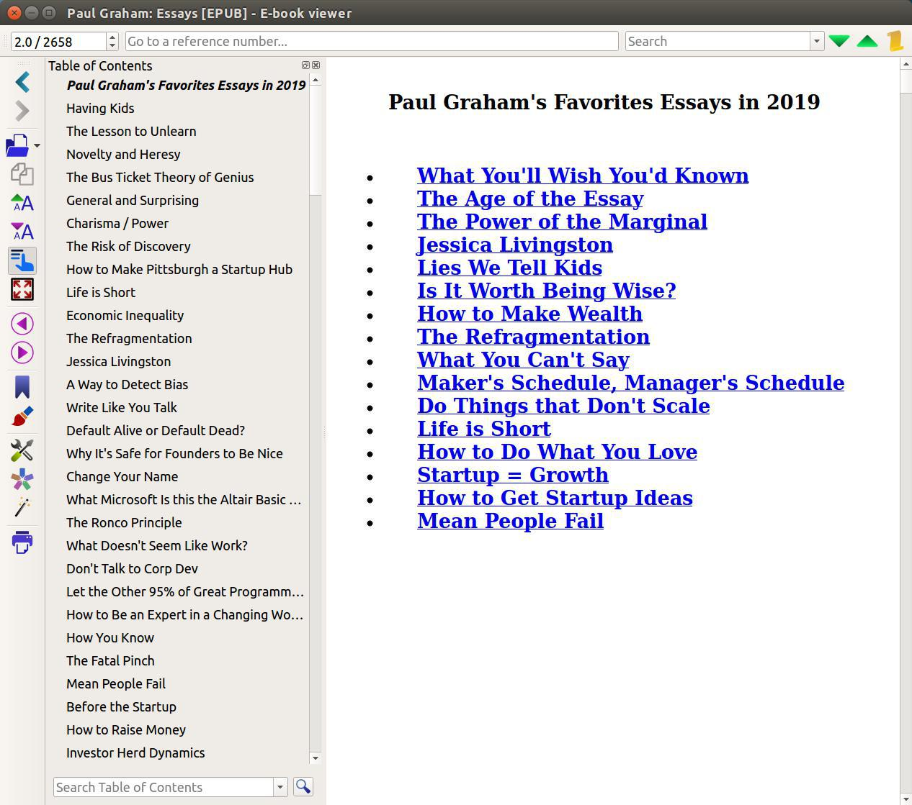

# Almost All of Paul Graham's Essays Before 2019



系统要求：

 - Python 2
 - Calibre

可以先运行这个脚本测试一下


```py
import xml.etree.ElementTree as ET
tree = ET.parse('rss.xml')
root = tree.getroot()
for child in root:
    title = child.find('title').text
    link = child.find('link').text
    print title, link
```


http://www.paulgraham.com/articles.html


下载可能需要半个小时左右，`paul_graham.recipe`中的文件路径根据自己需求修改一下。（不建议重复下载）


```sh
ebook-convert paul_graham.recipe paulgraham.mobi --output-profile kindle
```

使用calibre替换乱码，删除图片，统一字体大小，添加Paul Graham2019年最喜欢的几篇文章的目录后的版本是`All of Paul Graham's Essays Before 2019 - Paul Graham.epub/azw3`，原版本为`Paul Graham.mobi`

